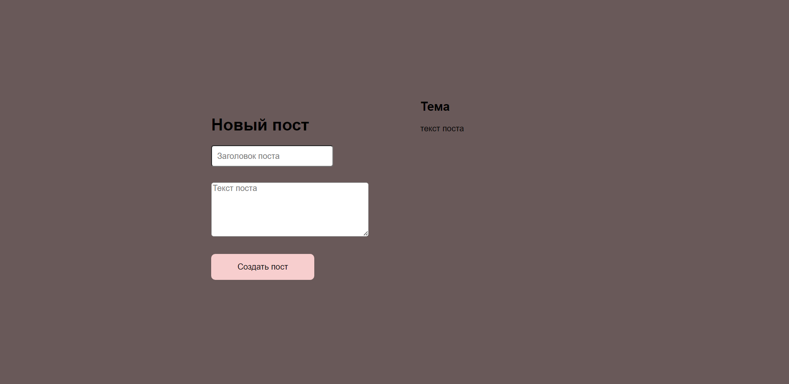

# Posts

Программа, которая добавляет посты на страницу.

Написана функция для создания постов, в ней идет вызов fetch, с двумя обработчиками then, который:

1. делает POST-запрос по адресу https://jsonplaceholder.typicode.com/posts;
2. с телом - JSON с двумя свойствами title и body;
3. со свойством headers с единственным заголовком: 'Content-Type': 'application/json; charset=UTF-8';
4. добавляет созданный пост в DOM.

<a href="https://jsonplaceholder.typicode.com/">Документация</a> сервиса JSONplaceholder.

Технологии:

  
 
   
  
  

